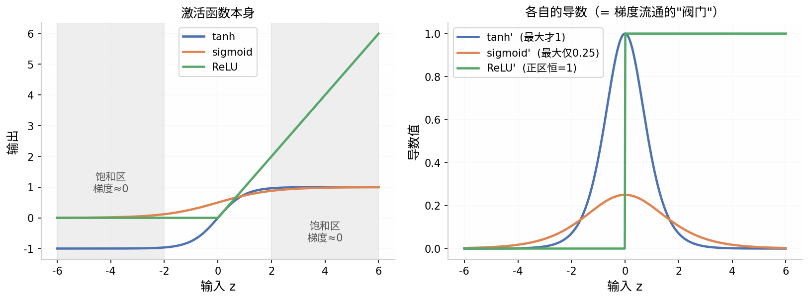
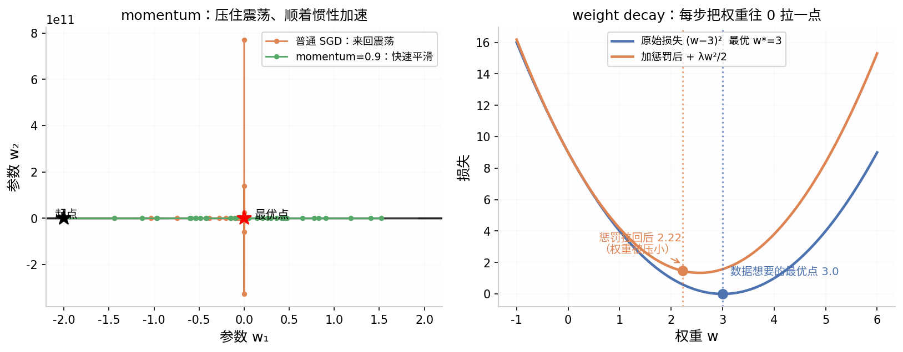

# 《ImageNet Classification with Deep Convolutional Neural Networks》阅读记录

> **论文信息**
> - 作者：Alex Krizhevsky, Ilya Sutskever, Geoffrey E. Hinton（University of Toronto）
> - 发表：NIPS 2012（即著名的 **AlexNet**，现代深度学习的开端之作）
> - 任务：ImageNet LSVRC 图像分类（1000 类）
> - 成绩：Top-5 错误率 15.3%，比第二名（26.2%）低约 11 个百分点

---

## 目录

- [一、论文脉络与核心贡献](#一论文脉络与核心贡献)
- [二、Dataset 与数据预处理](#二dataset-与数据预处理)
- [三、网络结构](#三网络结构)
- [四、减少过拟合](#四减少过拟合)
- [五、训练细节](#五训练细节)
- [六、逐层问答笔记（对话沉淀）](#六逐层问答笔记对话沉淀)
  - [Q1 卷积层 / 池化层 / 全连接层分别在干什么（矩阵视角）](#q1-卷积层--池化层--全连接层分别在干什么矩阵视角)
  - [Q2 通道、stride、padding 是什么](#q2-通道stridepadding-是什么)
  - [Q3 不同通道 = 不同的特征过滤器？](#q3-不同通道--不同的特征过滤器)
  - [Q4 池化层详解：max vs avg（LeNet vs AlexNet）](#q4-池化层详解max-vs-avglenet-vs-alexnet)
  - [Q5 全连接层在 CNN 中到底干什么](#q5-全连接层在-cnn-中到底干什么)
  - [Q6 为什么 FC6 是 4096×9216？W 的一行是什么？FC7/FC8 呢](#q6-为什么-fc6-是-40969216w-的一行是什么fc7fc8-呢)
  - [Q7 为什么 ReLU 比 tanh 快：梯度饱和与弥散](#q7-为什么-relu-比-tanh-快梯度饱和与弥散)
  - [Q8 神经元计算的本质（一个易错点）](#q8-神经元计算的本质一个易错点)
  - [Q9 weight decay 与 momentum 是什么](#q9-weight-decay-与-momentum-是什么)
- [七、修正与勘误（原笔记对照）](#七修正与勘误原笔记对照)
- [八、一句话总结](#八一句话总结)

---

## 一、论文脉络与核心贡献

| 部分 | 内容 |
|---|---|
| 背景 | 大数据时代：更大的数据 + 更大的模型才能充分利用数据，但必须解决过拟合；此前 CNN 受限于算力和数据规模，难以做大 |
| 时机 | **GPU（两块 GTX 580 3GB）+ ImageNet（120 万张图）** 两个条件成熟，使训练大 CNN 首次可行 |
| 贡献 1 | 训练了当时**最大规模的深度卷积网络**：5 卷积层 + 3 全连接层，6000 万参数、65 万神经元 |
| 贡献 2 | 在 GPU 上实现高效 2D 卷积，大幅降低训练时间（约 5~6 天） |
| 贡献 3 | 提出/验证关键技术：**ReLU、Dropout、数据增强、多 GPU 并行**，均成为此后十年的标准组件 |
| 结论 | **深度非常重要**：去掉任何一个卷积层，性能都会显著下降；更大的模型 + 更多有标签数据仍有提升空间 |

结构总览：

```mermaid
flowchart LR
    A["输入 224/227×224×3"] --> B["Conv1: 96×11×11, s4<br/>+ ReLU + LRN + MaxPool"]
    B --> C["Conv2: 256×5×5, pad2<br/>+ ReLU + LRN + MaxPool"]
    C --> D["Conv3: 384×3×3, pad1 + ReLU"]
    D --> E["Conv4: 384×3×3, pad1 + ReLU"]
    E --> F["Conv5: 256×3×3, pad1<br/>+ ReLU + MaxPool"]
    F --> G["FC6: 9216→4096<br/>+ ReLU + Dropout"]
    G --> H["FC7: 4096→4096<br/>+ ReLU + Dropout"]
    H --> I["FC8: 4096→1000<br/>→ softmax"]
```

## 二、Dataset 与数据预处理

- **ImageNet 子集（LSVRC）**：训练集约 **120 万张**图像，**1000 个类别**（不是 1500 万张/2 万类，见勘误）
- 预处理：统一缩放短边至 256，中心裁剪出 **256×256** 区域
- **关键立场：不做人工特征工程**（不抽 SIFT/HOG），直接从原始像素端到端学习——特征工程让位给特征学习
- 训练时再从 256×256 中随机裁剪 224×224（数据增强，见第四节）

## 三、网络结构

| 层 | 核 / 步长 | 输出尺寸 | 参数量 |
|---|---|---|---|
| Conv1 | 96 × 11×11×3, s4 | 55×55×96 | 3.5 万 |
| MaxPool1 | 3×3, s2 | 27×27×96 | 0 |
| Conv2 | 256 × 5×5×96, pad2 | 27×27×256 | 61 万 |
| MaxPool2 | 3×3, s2 | 13×13×256 | 0 |
| Conv3 | 384 × 3×3×256, pad1 | 13×13×384 | 89 万 |
| Conv4 | 384 × 3×3×384, pad1 | 13×13×384 | 132 万 |
| Conv5 | 256 × 3×3×384, pad1 | 13×13×256 | 88 万 |
| MaxPool3 | 3×3, s2 | 6×6×256 | 0 |
| FC6 | 9216 → 4096 | — | **3774 万** |
| FC7 | 4096 → 4096 | — | **1678 万** |
| FC8 | 4096 → 1000 | — | 410 万 |

网络切成两半放在两块 GPU 上（Figure 2），层间保留少量跨 GPU 连接。

### 结构中的四个关键设计

1. **ReLU 非线性**：不饱和非线性训练速度远超 tanh（CIFAR-10 上快约 6 倍，详见 Q7）
2. **多 GPU 训练**：3GB 显存放不下整个网络，按层切分并行
3. **局部响应归一化（LRN）**：第 1、2 卷积层后使用，模拟侧抑制，对泛化略有帮助（后被 BatchNorm 取代）
4. **重叠池化**：3×3 池化核、stride 2（窗口有 1 像素重叠），论文明确说明这降低了过拟合

## 四、减少过拟合

AlexNet 6000 万参数 vs 120 万张训练图，过拟合是头号敌人，用了三招：

### 1. 数据增强（Data Augmentation）
- **空间**：训练时随机裁剪 224×224（含水平翻转）→ 等效把数据集扩大 2048 倍
  - 测试时用 4 角 + 中心 5 个 crop 及其翻转，共 10 张做平均
- **颜色**：对 RGB 三通道做 **PCA 颜色扰动**——沿 ImageNet RGB 协方差矩阵的主方向随机加噪声，改变光照/颜色而不改变语义，降低对颜色的过拟合

### 2. Dropout
- 以 50% 概率随机将隐藏神经元输出置 0
- 作用类似**模型融合（ensemble）**：每次训练用的是不同的"子网络"，神经元无法依赖特定同伴（打破共适应）
- 应用于**前两个全连接层**（全网络参数最密集处）
- 代价：收敛轮数约翻倍

### 3. Weight decay（见 Q9）
- λ = 0.0005 的 L2 正则，只惩罚权重不惩罚偏置

## 五、训练细节

| 配置 | 取值 |
|---|---|
| 优化器 | 随机梯度下降（SGD）+ **momentum = 0.9** |
| weight decay | 0.0005（即 L2 正则） |
| 权重初始化 | 0 均值、**标准差 0.01** 的高斯分布 |
| 偏置初始化 | 第 2/4/5 卷积层与全连接层设为 **1**，其余为 0（避免 ReLU 开局"死亡"，见 Q7） |
| 学习率 | 初始 **0.01**，验证集错误率停滞时手动除以 10，共调了 3 次 |
| batch size | 128 |
| 训练量 | 约 90 epoch，两块 GPU 上 5~6 天 |

> 三个正交的调节旋钮：λ 定"目标函数的惩罚形状"，momentum 定"运动方式"，学习率定"步子大小"。

---

## 六、逐层问答笔记（对话沉淀）

### Q1 卷积层 / 池化层 / 全连接层分别在干什么（矩阵视角）

**全连接层：一次"全局投票"**

$$y = \sigma(Wx + b), \quad W \in \mathbb{R}^{m \times n}$$

每个输出 $y_i = \sigma(w_i^\top x + b_i)$ 是 $x$ 与 W 第 i 行的点积——**每个输出都连接所有输入**，是全局整合器。代价是参数量爆炸（AlexNet 两个 4096×4096 层约 1600 万参数，占全网络大半），最易过拟合（所以对它用 Dropout）。

**卷积层：很多个"局部点积"，共享同一个核矩阵**

$$\text{out}(i,j) = \sum_{u,v} x(i{+}u, j{+}v)\, k(u,v) + b = \big\langle \text{vec}(\text{patch}_{ij}),\ \text{vec}(K) \big\rangle$$

每个输出 = 输入的一个小窗口与核矩阵的点积；**同一个 K 滑遍全图**（权重共享，im2col 后就是一次矩阵乘法）。效果：局部模式检测器（边缘、纹理），**平移等变性**，参数量与输入尺寸无关。

**池化层：对局部块做"压缩取代表"**

$$\text{out}(i,j) = \max(\text{patch}_{ij}) \ \text{或}\ \text{mean}(\text{patch}_{ij})$$

无可学习参数的降采样：① 分辨率减半 → 后续计算量/参数减半；② **局部平移不变性**（块内移动 max 不变）；③ 等效扩大感受野。

**三者配合**：卷积层在局部找模式 → 池化层压缩并增强鲁棒性 → 全连接层汇总成最终判断。

### Q2 通道、stride、padding 是什么

**通道（channel）**：卷积核是三维的 `k × k × C_in`，计算输出点时要对每个输入通道各配一个核，分别点积再**求和**。**输出通道数 = 核的组数 = 并行检测器的数量**。AlexNet：Conv1 → 96，Conv2 → 256，Conv3/4 → 384，Conv5 → 256。通道越深语义越抽象：边缘 → 纹理 → 部件。

**stride**：窗口每次滑动的像素数。输出尺寸 $\lfloor(n-k)/s\rfloor + 1$。AlexNet 第一层：n=227, k=11, s=4 → 55。stride 大 → 省计算但可能漏细节。

**padding**：输入四周补 p 圈 0，n → n+2p。作用：① 控制输出尺寸（k=3, s=1, pad=1 时输入输出等大，即 same 卷积，防止深层网络特征图迅速缩水）；② 让边缘像素被同等次数扫描，避免边缘信息吃亏。

### Q3 不同通道 = 不同的特征过滤器？

**对。** 每个输出通道是一组可学习卷积核，产出一张特征图，图上数值 = "该模式在此处的响应强度"。论文 **Figure 3** 可视化验证了这一点：

- Conv1 通道：有方向的边缘、色块、颜色对比（类似 Gabor 滤波器）
- Conv5 通道：狗脸、眼睛、文字纹理等部件级模式

注意：通道语义是**网络自己学出来的**，我们的解读（边缘/纹理/部件）是事后观察的近似——一个通道可能同时响应多种模式，并非预先分配任务。

这也解释了 CNN 为何 work：传统方法（SIFT+SVM）过滤器是人工设计的固定滤波器，CNN 是从 120 万张图中学出**对分类最有判别力**的过滤器——特征工程变成了特征学习。

### Q4 池化层详解：max vs avg（LeNet vs AlexNet）

| | 平均池化 Avg（LeNet-5） | 最大池化 Max（AlexNet） |
|---|---|---|
| 语义 | 特征在块内"平均有多强" | 特征在块内"最强响应是多少" |
| 保留 | 整体能量/背景信息 | 最强的那个信号 |
| 梯度 | 平均分摊给块内所有元素 | 只从"赢家"元素回流（特征选择器） |
| 平移不变性 | 弱 | 强（最强值还在块内则输出不变） |

**为什么 AlexNet 弃 Avg 改用 Max**：平均池化会稀释强响应（块里一个强"眼睛"特征被背景平均掉）；max 直接回答"这里有没有强特征"，梯度只回传最强位置，训练信号更干净，深层网络效果更好。

但 Avg 并未退出：ResNet/GoogLeNet 结尾常用**全局平均池化（GAP）**替代 FC 层——结尾需保留整体信息而非单点最大值。两者分工：中间层 max 找特征，结尾 avg 做全局汇总。

细节差异：LeNet 用 2×2 不重叠池化（后面还接可学习系数 + sigmoid）；AlexNet 用 3×3 stride 2 的**重叠池化**，明确为降过拟合。

### Q5 全连接层在 CNN 中到底干什么

经过 5 卷积 + 3 池化，得到 256×6×6 = 9216 个"零件检测器"的响应值——**分散的证据**。FC 层负责把它们汇总成全局判决，三步：

1. **拉平（flatten）**：6×6×256 → 9216 维向量（刻意丢弃空间结构）
2. **矩阵乘法**：y = σ(Wx + b)，每个输出 = 整个向量与 W 一行点积
3. **softmax**：1000 个得分 → 概率分布

**为什么卷积层自己干不了**：卷积层是**平移等变**的（狗在左，"耳朵"特征图亮在左），它忠实记录位置但不会做决定；分类需要**决策不变性**（狗在左在右都输出"狗"）。FC 通过拉平 + 全局连接打破位置结构，位置信息完成使命后被丢弃。

**作用：学"特征的组合规则"**。每个 FC 神经元读取所有通道所有位置的响应，能表达"与"关系：狗 ≈ 耳朵通道有响应 **且** 鼻子通道有响应 **且** 毛发通道有响应。

**代价**：FC6/7/8 合计约 5860 万参数，占全网络 97%——既是决策核心又是过拟合重灾区，这是 Dropout 加在这里、后来 GAP 取代 FC 的原因。

### Q6 为什么 FC6 是 4096×9216？W 的一行是什么？FC7/FC8 呢

**9216 是被决定的**：Pool3 输出 256×6×6，拉平后维度唯一确定为 9216。
**4096 是人为选的超参数**：容量与过拟合的权衡 + 3GB 显存塞得下的极限 + 2 的幂利于 GPU 访存。

**W 的一行 = 一个隐藏神经元的"投票模板"**：wᵢ 的 9216 个数决定第 i 个神经元"关心什么、讨厌什么"（正权重兴奋、负权重抑制）。几何上 wᵢ 在 9216 维空间定义超平面，x 在其方向投影越大输出越大，ReLU 截断负投影。4096 行 = 4096 个学出来的组合模板。

三层过程：

$$\underbrace{x}_{9216} \xrightarrow[W_1]{+b_1,\ \text{ReLU},\ \text{Dropout}} \underbrace{h_1}_{4096} \xrightarrow[W_2]{+b_2,\ \text{ReLU},\ \text{Dropout}} \underbrace{h_2}_{4096} \xrightarrow[W_3]{+b_3} \underbrace{s}_{1000} \xrightarrow{\text{softmax}} p$$

- **FC6 (4096×9216, 3774 万参数)**：零件响应 → 4096 个高层概念的首次组合
- **FC7 (4096×4096, 1678 万参数)**：维度不变，作用是**再组合一层**——让概念读所有概念。没有 ReLU 两层线性等价于一层，非线性让层层组合有意义（"深度非常重要"的同一逻辑）
- **FC8 (1000×4096, 410 万参数)**：无 ReLU、无 Dropout，输出 1000 个 logits → softmax → 交叉熵损失

### Q7 为什么 ReLU 比 tanh 快：梯度饱和与弥散

**梯度饱和**：tanh/sigmoid 在 |z| 大时曲线平坦（输出恒为 ±1），导数趋近 0，神经元"卡死"，权重收不到更新信号。sigmoid 饱和区导数最大也只有 0.25。

**梯度弥散（vanishing gradient）**：梯度穿层是各层导数的**连乘**。tanh' ≤ 1（多数远小于 1），连乘后指数级缩小——8 层传到最前，梯度数值上≈0，前面的层学不到东西。ReLU 正区间导数**恒为 1**，梯度不衰减，误差信号可传很深。

**结果**：CIFAR-10 达到 25% 训练错误率，ReLU 比 tanh 快约 6 倍（论文 Figure 1）。论文强调快**不只是**因为计算便宜（ReLU 只是一次 max 比较），更主要是**避免饱和、加快学习收敛**——训练动力学层面的优势。

**副产品——稀疏性**：约一半神经元输出精确 0，计算更少、表征更稀疏。

**ReLU 的代价（dying ReLU）**：负区间梯度恒 0，输入全负的神经元永远收不到梯度，彻底死掉。这正是 AlexNet 把第 2/4/5 卷积层和 FC 层**偏置初始化为 1** 的原因——让神经元初期多落在正区间。

### Q8 神经元计算的本质（一个易错点）

> 神经网络 = "仿射变换（Wx+b）+ 非线性激活"逐层堆叠；三个 FC 层 + ReLU 就是一个多层感知机（MLP）。

每个神经元的计算严格分两步，**顺序不能反**：

$$h_i = \sigma(\,w_i^\top x \mathbf{+ b_i}\,) \quad \text{✓} \qquad \sigma(w_i^\top x) + b_i \quad \text{✗}$$

偏置必须在激活函数**内部**：神经元的决策边界是 w·x + b = 0，b 负责平移这条超平面（不穿原点）。若放在激活之后，b 穿不过非线性这道门，所有超平面都被迫过原点，表达能力大损。直觉：偏置是"触发阈值"——加权证据要超过多少才激活，阈值必须在激活之前才有意义。

### Q9 weight decay 与 momentum 是什么

**Weight decay = L2 正则化**，损失函数加权重平方惩罚：

$$L' = L_{data} + \frac{\lambda}{2}\|W\|^2 \;\Rightarrow\; W \leftarrow (1-\eta\lambda)W - \eta\nabla L_{data}$$

每一步把所有权重乘上小于 1 的因子（"decay"之名由来），像重力持续把权重往原点拉。作用：① 防过拟合（权重小 → 函数对输入扰动不敏感 → 决策边界平滑）；② 不许模型靠放大权重硬拟合噪声。AlexNet 取 λ=0.0005，**只惩罚 W 不惩罚 b**（b 只平移边界，不拟合精细形状）。与 Dropout 分工：一个平滑地缩，一个随机地拆。

**Momentum = 给更新加惯性**：

$$v \leftarrow \mu v - \eta \nabla L, \qquad W \leftarrow W + v$$

小球滚下损失曲面的物理图像：① **压震荡**——峡谷里来回相反的梯度相互抵消；② **顺坡加速**——方向一致时速度累积；③ **抗噪声**——等价于对 mini-batch 梯度做滑动平均。AlexNet 取 μ=0.9（历史方向占 90%），至今最常见。

---

## 七、修正与勘误（原笔记对照）

| 原笔记 | 修正 |
|---|---|
| "1500w 数据，2w 类" | 训练集约 **120 万张**，**1000 类** |
| "最终输出 4096 的向量" | 前两个 FC 层各输出 4096 维；**最后一个 FC 层输出 1000 维**（对应类别） |
| "weight decay（？）" | 即 **L2 正则化**，λ = 0.0005，只作用于权重 |
| "momentum（？）" | 动量 **μ = 0.9** |
| 学习率"0.01→好的反馈后降低十倍" | 验证集错误率停滞时**手动除以 10**，共 3 次 |
| 池化细节遗漏 | 3×3 核、**stride 2 重叠池化**；LRN 只在第 1、2 卷积层后 |
| 训练配置遗漏 | batch size = **128**；权重初始化 σ=0.01 高斯；偏置部分初始化为 1 |

## 八、一句话总结

> **卷积层** = 共享权重的局部点积（收集证据：什么模式、在哪里、多强）；
> **池化层** = 无参数的降采样（压缩证据、增强平移不变性）；
> **全连接层** = 全局矩阵乘法（汇总证据做判决）；
> **ReLU + Dropout + 数据增强 + weight decay** 共同压制过拟合与梯度弥散，让"深度"第一次真正可行——深度学习时代由此开始。
