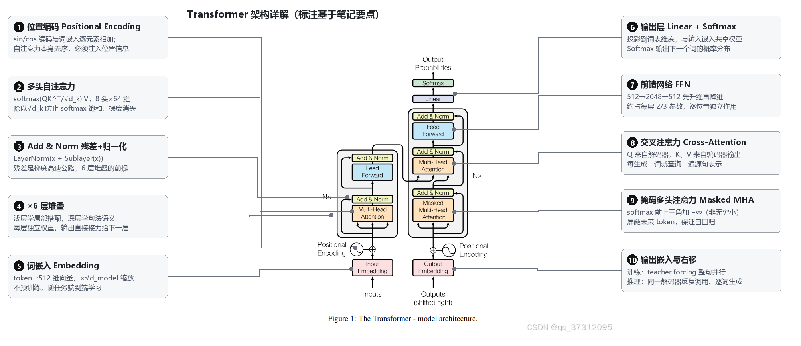
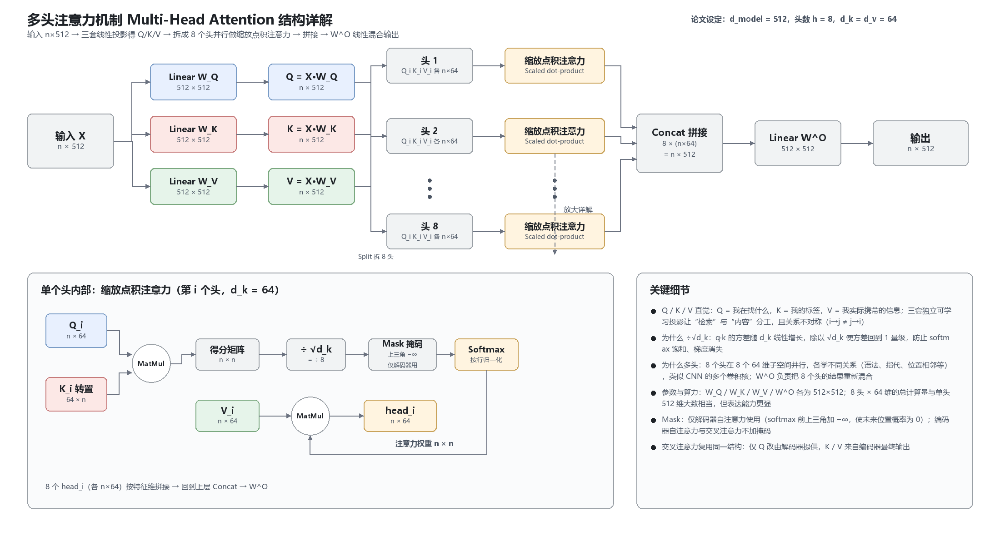

# Transformer 学习笔记

> 整理自个人原稿 + 补充。标注约定：
> - 🟦 **【原文】**：原稿内容，尽量保持原表述
> - 🟨 **【补充】**：后加的扩展讲解
> - 🟥 **【勘误】**：对原稿中不够准确之处的修正

---

## 一、背景与动机

🟦 **【原文】**
> 背景：图像处理-CNN，NLP-RNN，CNN 的卷积操作无法实现前后语义联系，RNN 依赖前文，串行计算影响计算效率。

🟨 **【补充】**
- **CNN 用于文本的局限**：卷积核的感受野有限，一次卷积只能看到局部 n-gram 窗口；要捕获长距离依赖需要堆叠很多层，路径长度为 O(n/k)。说"完全无法"前后语义联系略绝对，准确说是"捕获长距离依赖成本高"。
- **RNN 的两个核心问题**：
  1. **串行**：t 时刻的隐藏状态依赖 t-1 时刻，无法并行，训练慢；
  2. **长程遗忘**：梯度沿时间步连乘，容易梯度消失/爆炸，长距离信息衰减（LSTM/GRU 缓解但未根治）。
- **Transformer 的解法**：用自注意力让任意两个位置直接交互（路径长度 O(1)），且序列维度可全并行，把序列计算的复杂度瓶颈从"时间步串行"换成了"注意力矩阵 O(n²·d)"。

---

## 二、整体架构：编码器—解码器

🟦 **【原文】**
> 编解码结构：语义单元数字化，数值体现语义的相对关系。

🟨 **【补充】**
- 原论文是一个 **Encoder-Decoder** 结构（用于机器翻译）：
  - **编码器**：把源序列压缩成上下文表示，6 层堆叠（N=6），每层 = 多头自注意力 + 前馈网络，各配 Add & Norm。
  - **解码器**：6 层堆叠，每层 = 掩码多头自注意力 + 交叉注意力 + 前馈网络，各配 Add & Norm。
  - 输出端：Linear 投影到词表维度 → Softmax 得到下一个词的概率分布。
- **关键超参数**（论文 base 版）：`d_model = 512`，层数 `N = 6`，头数 `h = 8`，`d_k = d_v = 64`，FFN 隐层 `d_ff = 2048`，dropout = 0.1。
- "语义单元数字化，数值体现语义的相对关系"对应的是**分布式表示（distributed representation）**思想：词被映射为稠密向量，语义相近的词向量距离近（如 king − man + woman ≈ queen）。




---

## 三、词嵌入（Embedding）

🟦 **【原文】**
> 词嵌入 embedding：word2vec：CBOW：选出奇数 token，择出中间的向量，计算剩余目标向量的计算值与该向量的差值作为损失函数训练嵌入矩阵。

🟥 **【勘误】**
- CBOW 的准确描述是：**用窗口内周围的上下文词向量（求和/平均）去预测中心词**；损失是"预测的中心词分布"与"真实中心词"之间的交叉熵（实践中用负采样/层级 softmax 加速），而不是"剩余向量与该向量的差值"。"选出奇数 token"并非 CBOW 的定义，可能是"取奇数个词作为窗口"的记忆。
- 与 CBOW 对称的是 **Skip-gram**：用中心词预测周围词。

🟨 **【补充】**
- Transformer 不用预训练 word2vec，而是**随机初始化嵌入矩阵并随任务端到端训练**；嵌入维度 = `d_model = 512`。
- 论文里嵌入向量会**乘以 √d_model**，以平衡与位置编码相加时的量级。
- 输入嵌入矩阵与输出端 Linear 投影矩阵**共享权重**（weight tying）。

---

## 四、位置编码（Positional Encoding）

🟦 **【原文】**
> 位置编码：矩阵相加。

🟨 **【补充】**
- 自注意力本身**对顺序不敏感**（打乱输入词序，注意力结果不变），所以必须显式注入位置信息。
- 论文使用正弦/余弦编码，与词嵌入**逐元素相加**（原文"矩阵相加"正确）：

```
PE(pos, 2i)   = sin(pos / 10000^(2i/d_model))
PE(pos, 2i+1) = cos(pos / 10000^(2i/d_model))
```

- 优点：不同频率对应不同尺度的位置；`PE(pos+k)` 可表示为 `PE(pos)` 的线性函数，便于模型学习相对位置；推理时可外推到比训练更长的序列。
- 后续变体：可学习位置编码（BERT/GPT）、相对位置编码、RoPE 旋转位置编码（LLaMA 等现代模型主流）。

---

## 五、注意力机制

### 5.1 缩放点积注意力（Scaled Dot-Product Attention）

🟦 **【原文】**
> 自注意力：QKV，Q·Kᵀ = A，A 除以 √d 得到 A′：让注意力得分矩阵仍然为标准正态分布，表示词的上下文关系。

🟥 **【勘误】**
- 除的是 **√d_k（key 向量的维度）**，论文中 d_k = 64，不是输出维度。
- 目的准确说不是"保持标准正态分布"，而是：若 q、k 各分量独立、均值 0 方差 1，则点积 q·k 的方差为 d_k，d_k 大时点积数值很大，把 softmax 压到梯度极小的饱和区；除以 √d_k 使方差回到 1 量级，**防止 softmax 饱和导致梯度消失**。

🟨 **【补充】**
- 完整公式：

```
Attention(Q, K, V) = softmax(QKᵀ / √d_k) · V
```

- **Q/K/V 的直觉**：Q（查询）= 我在找什么；K（键）= 我是什么的标签；V（值）= 我实际携带的信息。三者都是输入 X 乘不同可学习矩阵 W_Q、W_K、W_V 得到。
- **自注意力**：Q、K、V 来自**同一个**序列，每个词与序列中所有词（包括自己）计算相关度，输出是"按相关性加权的信息混合"，这就是"词的上下文关系"的数学化。

### 5.2 交叉注意力（Cross-Attention）

🟦 **【原文】**
> 交叉注意力：QK 来自于已有的语料，一般在上文较浅的部分。

🟥 **【勘误】**
- 交叉注意力（编码器—解码器注意力）中：**Q 来自解码器上一层的输出，K 和 V 来自编码器的最终输出**。不是"QK 来自已有语料"，也不存在"上文较浅"的说法。
- 作用：解码器每生成一个词，都去"查询"一遍源句子的编码表示，实现对齐（翻译时对应原文的哪个词）。

### 5.3 掩码（Mask）

🟦 **【原文】**
> 掩码：注意力矩阵 A 上半矩阵加无穷小。

🟥 **【勘误】**
- 是加 **−∞（负无穷大，实践中用一个很大的负数如 −10⁹）**，不是"无穷小"。softmax 后这些位置的概率变为 0，从而屏蔽未来信息。
- 掩码作用在 softmax **之前**的得分矩阵上，位置是上三角（不含对角线）。

🟨 **【补充】**
- **为什么需要**：训练时解码器用 teacher forcing 一次性输入整个目标序列，若不掩码，预测第 t 个词时能看到第 t 及之后的答案，造成信息泄露。掩码保证自回归性质：位置 i 只能attend 到 ≤ i 的位置。
- 另一种是 **padding mask**：屏蔽补齐位置的无效 token。

---

## 六、多头注意力（Multi-Head Attention）

🟦 **【原文】**
> 多头注意力机制：（原稿留白）

🟨 **【补充】**
- 不直接做一次 d_model 维的注意力，而是把 Q、K、V **线性投影成 h 份**（h = 8，每份 d_k = d_model/h = 64），各自独立做注意力，再拼接、过一次线性层：

```
MultiHead(Q,K,V) = Concat(head₁…head_h)·W^O
head_i = Attention(QW_i^Q, KW_i^K, VW_i^V)
```

- **意义**：不同头可以在不同表示子空间学习不同的关系（有的头学语法依存，有的头学指代，有的头学位置相邻），类似 CNN 的多个卷积核。
- 8 个头 × 64 维的总计算量与单头 512 维大致相当，但表达能力更强。




---

## 七、残差连接与层归一化（Add & Norm）

🟦 **【原文】**
> 残差网络：输入输出直接相加，变化的程度；norm：LayerNorm。

🟨 **【补充】**
- 每个子层（注意力/FFN）的输出是 `LayerNorm(x + Sublayer(x))`：
  - **残差连接**：让梯度有高速公路可回传，缓解深层网络的梯度消失；模型只需学习"增量（变化的程度）"而非完整映射，训练更稳。
  - **LayerNorm**：对单个样本的 d_model 维做归一化（减均值除方差 + 可学习缩放平移），稳定数值分布。与 BatchNorm 的区别：LayerNorm 不依赖 batch，适合变长序列。
- **Post-LN（原论文）**：先残差再归一化；**Pre-LN（后来主流）**：先归一化再进子层，深层模型更易训练，可去掉学习率 warmup。这是原论文之后的重要工程改进。

---

## 八、前馈网络（Feed-Forward Network）

🟨 **【补充】**（原稿未涉及，是架构中不可缺的部分）
- 每个位置独立通过同一个两层全连接网络：

```
FFN(x) = max(0, xW₁ + b₁)W₂ + b₂
```

- 维度变化：512 → 2048 → 512（先升维再降维）。
- 注意力负责"词与词之间混合信息"，FFN 负责"每个位置内部的非线性变换"，两者分工互补。
- **参数量大头**：FFN 约占每层参数的 2/3，后续 MoE（混合专家）主要就是在 FFN 上做文章。

---

## 九、训练与推理流程

🟨 **【补充】**
- **训练**：teacher forcing —— 解码器输入是"右移一位"的真实目标序列（开头加 `<bos>`），配合掩码并行计算所有位置的损失。
- **推理**：自回归 —— 逐步生成，每步把已生成序列重新喂入解码器，取 softmax 概率最高（或采样/束搜索）的词接到末尾，直到 `<eos>`。
- **训练细节**：Adam 优化器 + 学习率 warmup（先升后降）；label smoothing ε = 0.1；base 模型在 8 块 P100 上训练约 12 小时。
- **复杂度**：自注意力 O(n²·d)，FFN O(n·d²)；n 长时注意力是瓶颈（催生了 FlashAttention、稀疏注意力等优化）。

---

## 十、后续发展（从 Transformer 开枝散叶）

🟨 **【补充】**
- **Encoder-only**：BERT 系 —— 双向理解，完形填空式预训练，用于分类/抽取。
- **Decoder-only**：GPT 系、LLaMA 系 —— 只保留掩码自注意力，自回归生成，是当前大语言模型主流架构。
- **Encoder-Decoder**：T5、BART —— 保留原论文完整结构，用于翻译、摘要等 seq2seq 任务。
- **跨模态**：ViT 把图像切块当 token；多模态模型把图像/音频编码后接入同一框架——印证了 Transformer 作为通用序列建模架构的地位。

---

## 附：原稿要点勘误对照表

| 原稿表述 | 修正 |
| --- | --- |
| CBOW：选奇数 token，算剩余向量与中间向量的差值 | CBOW 用上下文词预测中心词，损失为交叉熵（负采样近似） |
| 除以 √d 使得分矩阵为标准正态分布 | 除以 √d_k（=64）使点积方差回到 1 量级，防止 softmax 饱和 |
| 交叉注意力 QK 来自已有语料、上文较浅部分 | Q 来自解码器，K/V 来自编码器最终输出 |
| 掩码：上三角加无穷小 | 上三角加 −∞（softmax 前），使未来位置概率为 0 |
| 位置编码：矩阵相加 | 正确，sin/cos 编码与词嵌入逐元素相加 |
